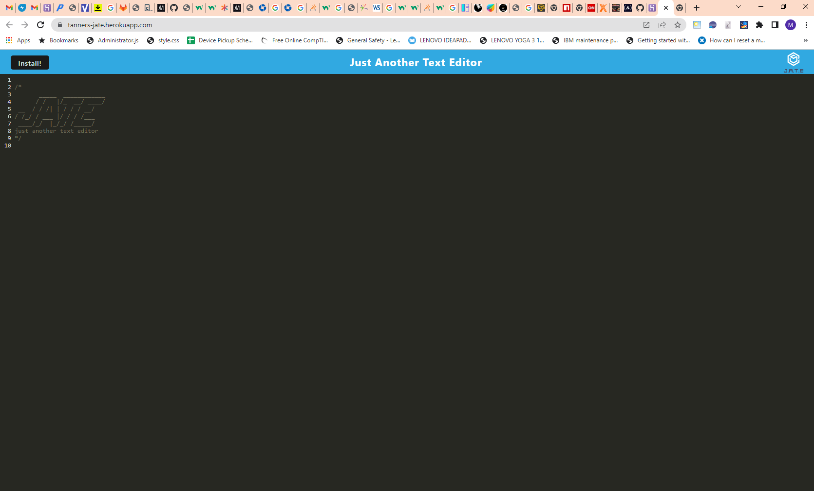

# Great_JATE
This is a student programing project demonstrating Progressive Web Application (PWA) facilities.  

  

## Introduction  

J.A.T.E (Just Another Text Editor) is a single page text editor application that runs in the browser and meets Progressive Web Application (PWA) criteria, that is - works offline, may be installed, and implements an "app shell" architecture. Additionally, it incorporates redundant data assurance features including browser local storage and IndexedDB.  

## Links  

The Git Repository containing this porject code and this README file: https://github.com/mjtanner-github/Great_JATE.   
The Heroku deployment: https://tanners-jate.herokuapp.com/.

## Features

- Works without an internet connection and may be installed as a PWA. 

- Employs an IndexedDB and implements both GET and PUT methods.

- Saves content from the text editor automatically when user focused changes away from the application window.

## Technology

- _Babel_ to implement async and await.

- _Webpack_ application component bundling.

- _WebpackPwaManifest_ Application to generated manifest.json.

- _Workbox_  service worker that caches static assets.

## Routine Usage

Just click on the link or the PWA shortcut. Then you type, delete, cut and paste like you do. There is no saving; that's always done automatically, when your click away from the window or close the application. It's always there when you come back.

## License 

All materials in this repository other than this document are copyrighted bt Trilogy Education Services, LLC:   
© 2022 Trilogy Education Services, LLC, a 2U, Inc. brand. Confidential and Proprietary. All Rights Reserved.
